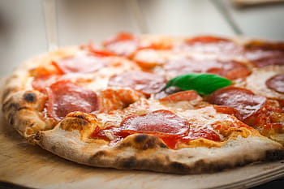

## Matt Colton

Hi! I'm Matt Colton, a freshman Software Engineering major at RIT, and this is my GitHub Pages site!

#### Rundown

I'm from Fairport, NY, a suburb not far from RIT, and attended McQuaid Jesuit High School. During my time there, my big 'thing' was the robotics team, ours being IgKnighters Team 3173. Robotics played a large part in my interest in programming in an engineering setting, and is a large part of why I'm excited to work on bigger projects in my future.

#### Favorite Food

I'm one of the very few people in the United States that likes pizza!

#### [se.rit.edu/~swen-101/](https://se.rit.edu/~swen-101/)

#### What I'd like to learn from SWEN 101

  - Firm understanding of various work ethics within software engineering
  - A higher abliity to effectively communicate complex concepts
  - Knowledge on how to efficiently initiate and manage projects
